# Idea Graph — Convergence of Systems, AI, and Reasoning

> Last updated: 2026-05-14 — added Bayesian Brain, Active Inference, Robotics Architecture, five missing candidates, five research tracks, hardware stack

```mermaid
graph TD

    %% ── INFRASTRUCTURE CLUSTER ──────────────────────────────────────────
    Docker["🐳 Docker\n(containerisation)"]
    Kubernetes["☸ Kubernetes\n(orchestration)"]
    LoadBalancing["Load Balancing\n(traffic distribution)"]
    CICD["CI/CD\n(automated delivery)"]
    Observability["Observability\n(metrics, logs, traces)"]
    Grafana["Grafana\n(visualisation)"]
    DevOps["DevOps\n(culture + toolchain)"]
    MLOps["MLOps\n(ML lifecycle ops)"]

    Docker --> Kubernetes
    LoadBalancing --> Kubernetes
    Kubernetes --> DevOps
    CICD --> DevOps
    Grafana --> Observability
    Observability --> DevOps
    Observability --> MLOps
    MLOps --> DevOps

    %% ── AI THEORY CLUSTER ───────────────────────────────────────────────
    NeuralAI["Neural AI\n(learn from data)"]
    SymbolicAI["Symbolic AI\n(rules + logic)"]
    NeurosymbolicAI["Neurosymbolic AI\n(perception + reasoning)"]
    ProgramSynthesis["Program Synthesis\n(generate programs from specs)"]
    KnowledgeEng["Knowledge Engineering\n(encode expert knowledge)"]
    Ontologies["Ontologies\n(formal vocabularies)"]
    ExpertSystems["Expert Systems\n(inference over KB)"]

    NeuralAI --> NeurosymbolicAI
    SymbolicAI --> NeurosymbolicAI
    SymbolicAI --> KnowledgeEng
    KnowledgeEng --> Ontologies
    KnowledgeEng --> ExpertSystems
    ProgramSynthesis --> NeurosymbolicAI

    %% ── CONVERGENCE: INTELLIGENT OS ─────────────────────────────────────
    IntelligentOS["⚡ Intelligent OS\n(unified substrate)"]

    NeurosymbolicAI --> IntelligentOS
    ProgramSynthesis --> IntelligentOS
    KnowledgeEng --> IntelligentOS
    Observability --> IntelligentOS
    Kubernetes --> IntelligentOS

    %% ── MADOMASI (applied project) ──────────────────────────────────────
    TransferLearning["Transfer Learning\n(MobileNetV3Small)"]
    GradCAM["Grad-CAM\n(explainability)"]
    OOD["OOD Detection\n(entropy threshold)"]
    Madomasi["🍅 Madomasi\n(tomato disease classifier)"]

    TransferLearning --> Madomasi
    GradCAM --> Madomasi
    OOD --> Madomasi
    Madomasi --> NeuralAI
    Madomasi --> MLOps
    Madomasi --> KnowledgeEng

    %% ── BAYESIAN BRAIN / ACTIVE INFERENCE CLUSTER ──────────────────────
    BayesianBrain["🧠 Bayesian Brain\n(predictive processing)"]
    ActiveInference["Active Inference\n(Friston — free energy min.)"]
    PredictiveError["Prediction Error\n(reality − expectation)"]
    GenerativeModel["Generative Model\n(prior over world states)"]
    PrecisionWeighting["Precision Weighting\n(attention mechanism)"]

    BayesianBrain --> ActiveInference
    BayesianBrain --> GenerativeModel
    ActiveInference --> PredictiveError
    ActiveInference --> PrecisionWeighting
    GenerativeModel --> PredictiveError
    PrecisionWeighting --> PredictiveError

    %% ── ROBOTICS ARCHITECTURE CLUSTER ──────────────────────────────────
    RobotKernel["Robot Kernel\n(real-time, PREEMPT_RT)"]
    RobotModel["Robot Model\n(world + body + goal)"]
    RobotHarness["Robot Harness\n(behaviour orchestrator)"]
    Behaviours["Behaviours\n(skills / reflexes)"]
    BindingSubstrate["Binding Substrate\n(global state / shared model)"]
    BehaviourSpec["BehaviourSpec API\n(lifecycle contract)"]
    sched_ext["sched_ext\n(eBPF scheduler — Linux 6.12)"]
    eBPF["eBPF\n(kernel-resident harness)"]

    RobotKernel --> RobotModel
    RobotModel --> RobotHarness
    RobotHarness --> Behaviours
    Behaviours --> BehaviourSpec
    RobotHarness --> BehaviourSpec
    BindingSubstrate --> RobotKernel
    BindingSubstrate --> RobotModel
    BindingSubstrate --> RobotHarness
    BindingSubstrate --> Behaviours
    eBPF --> RobotKernel
    sched_ext --> RobotKernel
    Kubernetes --> RobotHarness

    %% ── ACTIVE INFERENCE AS FOUNDATION ─────────────────────────────────
    ActiveInference --> BindingSubstrate
    GenerativeModel --> RobotModel
    PredictiveError --> BindingSubstrate
    PrecisionWeighting --> RobotHarness
    ActiveInference --> RobotKernel
    ActiveInference --> Behaviours

    %% ── CONNECTIONS TO INTELLIGENT OS ───────────────────────────────────
    BayesianBrain --> IntelligentOS
    ActiveInference --> IntelligentOS
    BindingSubstrate --> IntelligentOS
    RobotHarness --> IntelligentOS

    %% ── CANDIDATE 1: LEARNING LOOP ─────────────────────────────────────
    LearningLoop["C1: Learning Loop\n(experience → model update)"]
    OfflineImagination["Offline Imagination\n(dreaming — idle replay)"]

    LearningLoop --> GenerativeModel
    LearningLoop --> OfflineImagination
    OfflineImagination --> GenerativeModel
    ActiveInference --> LearningLoop
    PredictiveError --> LearningLoop

    %% ── CANDIDATE 2: GOAL SOURCE ────────────────────────────────────────
    ValuesKB["Values KB\n(formal goals + norms)"]
    GoalManager["C2: Goal Source\n(values + world + uncertainty → goal)"]
    IntrinsicMotivation["Intrinsic Motivation\n(epistemic foraging)"]

    ValuesKB --> GoalManager
    KnowledgeEng --> ValuesKB
    GoalManager --> RobotHarness
    GoalManager --> Behaviours
    GenerativeModel --> GoalManager
    IntrinsicMotivation --> GoalManager
    ActiveInference --> IntrinsicMotivation

    %% ── CANDIDATE 3: PREDICTION / IMAGINATION ───────────────────────────
    ForwardModel["C3: Forward Model\n(f(state, action) → next state)"]
    MentalSimulation["Mental Simulation\n(imagine before acting)"]
    ImagBudget["Imagination Budget\n(harness-managed depth)"]

    ForwardModel --> MentalSimulation
    GenerativeModel --> ForwardModel
    MentalSimulation --> ImagBudget
    ImagBudget --> RobotHarness
    MentalSimulation --> GoalManager
    MentalSimulation --> LearningLoop
    OfflineImagination --> ForwardModel

    %% ── CANDIDATE 4: BINDING (resolved — see BindingSubstrate) ─────────
    GenerativeModel --> BindingSubstrate

    %% ── CANDIDATE 5: COMMUNICATION ──────────────────────────────────────
    TheoryOfMind["C5: Theory of Mind\n(model of other agents)"]
    SemanticProtocol["Semantic Protocol\n(beliefs + confidence + intent)"]
    TrustManager["Trust Manager\n(source reliability estimates)"]
    SocialModel["Social Model\n(roles, norms, obligations)"]
    MultiAgentSwarm["Multi-Agent Swarm\n(distributed generative model)"]

    TheoryOfMind --> SemanticProtocol
    TheoryOfMind --> TrustManager
    TheoryOfMind --> SocialModel
    SemanticProtocol --> MultiAgentSwarm
    SocialModel --> ValuesKB
    KnowledgeEng --> SocialModel
    GenerativeModel --> TheoryOfMind
    TheoryOfMind --> GoalManager
    MultiAgentSwarm --> IntelligentOS
    TrustManager --> RobotHarness
    GradCAM --> SemanticProtocol

    %% ── HARDWARE PLATFORM ───────────────────────────────────────────────
    RPi["🍓 Raspberry Pi\n(Linux 6.12 — owned)"]
    PiCamera["Pi Camera v3\n(~$25)"]
    IMU["IMU MPU-6050\n(~$3)"]
    Servos["Servos + PCA9685\n(~$15)"]
    PiPico["Pi Pico RP2040\n(~$4 — hard real-time)"]
    PiZero["Pi Zero 2W\n(~$15 — swarm node)"]

    PiCamera --> RPi
    IMU --> RPi
    Servos --> RPi
    PiPico --> RPi
    RPi --> Docker
    RPi --> eBPF
    RPi --> sched_ext

    %% ── RESEARCH TRACK 1: KERNEL HARNESS ───────────────────────────────
    RT1["RT1: Kernel Harness\n(eBPF + sched_ext on Pi)"]

    RPi --> RT1
    eBPF --> RT1
    sched_ext --> RT1
    RT1 --> RobotKernel
    RT1 --> Observability

    %% ── RESEARCH TRACK 2: ACTIVE INFERENCE ON HARDWARE ─────────────────
    RT2["RT2: Active Inference Hardware\n(pymdp + Pi + sensors)"]

    RPi --> RT2
    PiCamera --> RT2
    IMU --> RT2
    Servos --> RT2
    ActiveInference --> RT2
    RT2 --> ForwardModel
    RT2 --> LearningLoop

    %% ── RESEARCH TRACK 3: BEHAVIOURSPEC API ────────────────────────────
    RT3["RT3: BehaviourSpec API\n(ROS 2 lifecycle + Pi)"]

    RPi --> RT3
    BehaviourSpec --> RT3
    RobotHarness --> RT3
    Kubernetes --> RT3
    RT3 --> Behaviours
    RT3 --> GoalManager

    %% ── RESEARCH TRACK 4: MULTI-AGENT SWARM ────────────────────────────
    RT4["RT4: Pi Swarm\n(distributed belief propagation)"]

    PiZero --> RT4
    RT4 --> MultiAgentSwarm
    RT4 --> SemanticProtocol
    RT4 --> TrustManager
    RT3 --> RT4

    %% ── RESEARCH TRACK 5: EMBODIED MADOMASI ────────────────────────────
    RT5["RT5: Embodied Madomasi\n(Pi + camera arm → plant diagnosis)"]

    Madomasi --> RT5
    PiCamera --> RT5
    Servos --> RT5
    RT5 --> RT2
    RT5 --> GoalManager
    GradCAM --> RT5

    %% ── RESEARCH PROGRESSION ────────────────────────────────────────────
    RT1 --> RT2
    RT2 --> RT3
    RT5 --> RT3
    RT3 --> RT4

    %% ── CROSS-LAYER BRIDGES ─────────────────────────────────────────────
    NeuralAI --> MLOps
    SymbolicAI --> CICD
    KnowledgeEng --> IntelligentOS
    NeurosymbolicAI --> ActiveInference
    NeuralAI --> BayesianBrain
    SymbolicAI --> GenerativeModel
    GoalManager --> IntelligentOS
    ForwardModel --> IntelligentOS
    TheoryOfMind --> IntelligentOS

    %% ── STYLING ─────────────────────────────────────────────────────────
    style IntelligentOS fill:#1a1a2e,color:#e0e0e0,stroke:#7b2fff,stroke-width:3px
    style Madomasi fill:#1a2e1a,color:#e0e0e0,stroke:#2fff7b,stroke-width:2px
    style NeurosymbolicAI fill:#2e1a2e,color:#e0e0e0,stroke:#ff7b2f,stroke-width:2px
    style DevOps fill:#1a2040,color:#e0e0e0,stroke:#2f7bff
    style MLOps fill:#1a2040,color:#e0e0e0,stroke:#2f7bff
    style BayesianBrain fill:#2e1a0a,color:#e0e0e0,stroke:#ffaa2f,stroke-width:3px
    style ActiveInference fill:#2e1a0a,color:#e0e0e0,stroke:#ffaa2f,stroke-width:2px
    style BindingSubstrate fill:#0a1a2e,color:#e0e0e0,stroke:#2fffee,stroke-width:3px
    style RobotHarness fill:#1a0a2e,color:#e0e0e0,stroke:#aa2fff,stroke-width:2px
    style RobotModel fill:#1a0a2e,color:#e0e0e0,stroke:#aa2fff,stroke-width:2px
    style RobotKernel fill:#1a0a2e,color:#e0e0e0,stroke:#aa2fff,stroke-width:2px
    style LearningLoop fill:#1a2e10,color:#e0e0e0,stroke:#5fff2f,stroke-width:2px
    style GoalManager fill:#2e2010,color:#e0e0e0,stroke:#ffcc2f,stroke-width:2px
    style ValuesKB fill:#2e2010,color:#e0e0e0,stroke:#ffcc2f
    style ForwardModel fill:#102e2e,color:#e0e0e0,stroke:#2fffcc,stroke-width:2px
    style MentalSimulation fill:#102e2e,color:#e0e0e0,stroke:#2fffcc
    style TheoryOfMind fill:#2e1010,color:#e0e0e0,stroke:#ff2f2f,stroke-width:2px
    style SocialModel fill:#2e1010,color:#e0e0e0,stroke:#ff2f2f
    style MultiAgentSwarm fill:#2e1010,color:#e0e0e0,stroke:#ff2f2f,stroke-width:2px
    style RPi fill:#2e0a0a,color:#e0e0e0,stroke:#ff5555,stroke-width:3px
    style RT1 fill:#0a2e0a,color:#e0e0e0,stroke:#55ff55,stroke-width:2px
    style RT2 fill:#0a2e0a,color:#e0e0e0,stroke:#55ff55,stroke-width:2px
    style RT3 fill:#0a2e0a,color:#e0e0e0,stroke:#55ff55,stroke-width:2px
    style RT4 fill:#0a2e0a,color:#e0e0e0,stroke:#55ff55,stroke-width:2px
    style RT5 fill:#0a2e0a,color:#e0e0e0,stroke:#55ff55,stroke-width:2px
```



---

## Node Index

| Node | Layer | Role |
|------|-------|------|
| Docker | Infrastructure | Package and isolate runtime environments |
| Kubernetes | Infrastructure | Orchestrate containers at scale |
| Load Balancing | Infrastructure | Distribute demand across instances |
| CI/CD | Infrastructure | Automate test-build-deploy pipeline |
| Observability | Infrastructure | Expose system state (metrics, logs, traces) |
| Grafana | Infrastructure | Visualise observability data |
| DevOps | Culture | Bridge development and operations |
| MLOps | Culture | Apply DevOps discipline to ML lifecycle |
| Neural AI | AI Theory | Learn representations from data |
| Symbolic AI | AI Theory | Reason over explicit rules and logic |
| Neurosymbolic AI | AI Theory | Combine perception with reasoning |
| Program Synthesis | AI Theory | Generate programs from high-level specs |
| Knowledge Engineering | AI Theory | Encode and formalise expert knowledge |
| Ontologies | AI Theory | Formal vocabularies for a domain |
| Expert Systems | AI Theory | Inference engines over knowledge bases |
| Intelligent OS | Convergence | Proposed unified substrate — perceives, reasons, synthesises, acts |
| Transfer Learning | Applied ML | Adapt pretrained weights to new domain |
| Grad-CAM | Applied ML | Localise model attention for explainability |
| OOD Detection | Applied ML | Reject low-confidence out-of-distribution inputs |
| Madomasi | Project | Applied neurosymbolic ML system (implicit) |
| Bayesian Brain | Foundation | Brain as prediction machine — minimises surprise across all processing |
| Active Inference | Foundation | Friston's Free Energy Principle — perception and action as one inference process |
| Prediction Error | Signal | reality − expectation; the single currency that binds all layers |
| Generative Model | Foundation | Prior probability distribution over world states; updated by sensory input |
| Precision Weighting | Mechanism | Amplifies prediction errors by reliability — IS the attention mechanism |
| Robot Kernel | Robotics | Real-time layer (PREEMPT_RT/Zephyr); proprioceptive prediction error loop |
| Robot Model | Robotics | World model + body model + goal model; the generative model instantiated |
| Robot Harness | Robotics | Behaviour orchestrator — Kubernetes for robot skills |
| Behaviours | Robotics | Goal-directed processes (navigate, grasp, avoid); lifecycle-managed by harness |
| Binding Substrate | Robotics | Shared generative model that makes all layers one coherent system |
| BehaviourSpec API | Robotics | Undefined contract a behaviour exposes to the harness (open problem) |
| eBPF | Systems | Kernel-resident harness code — observation and enforcement in same context |
| sched_ext | Systems | eBPF-based scheduler in Linux 6.12 — policy becomes kernel |
| **C1: Learning Loop** | Missing Candidate | Experience feeds back to update the generative model — resolved by active inference (prediction error drives model update) |
| Offline Imagination | C1 | Dreaming — replaying and simulating experience when idle to consolidate learning |
| **C2: Goal Source** | Missing Candidate | Generates goals from values KB + world state + uncertainty; sits above the harness |
| Values KB | C2 | Formal knowledge base of what matters — encodes values as symbolic structure |
| Intrinsic Motivation | C2 | Epistemic foraging — robot generates goals by seeking regions of high model uncertainty |
| **C3: Forward Model** | Missing Candidate | f(state, action) → predicted next state; same as generative model used for planning |
| Mental Simulation | C3 | Running the forward model without committing to action — imagination before acting |
| Imagination Budget | C3 | Harness-managed compute allocation for simulation depth vs. decision urgency |
| **C4: Binding** | Missing Candidate | Resolved — the shared generative model IS the binding substrate; no separate mechanism needed |
| **C5: Theory of Mind** | Missing Candidate | Model of other agents — their beliefs, goals, uncertainties; qualitatively separate from physical world model |
| Semantic Protocol | C5 | Communication layer carrying beliefs + confidence + intent, not just raw data |
| Trust Manager | C5 | Maintains reliability estimates for each communication source; updated by experience |
| Social Model | C5 | Generative model extended to cover roles, norms, obligations, and agent relationships |
| Multi-Agent Swarm | C5 | Distributed generative model across many robots — collective intelligence via belief propagation |
| **Raspberry Pi** | Hardware | Primary research platform — Linux 6.12, eBPF, sched_ext, GPIO, Docker, TFLite — already owned |
| Pi Camera v3 | Hardware | Vision / perception input (~$25) |
| IMU MPU-6050 | Hardware | Proprioception / orientation sensing (~$3) |
| Servos + PCA9685 | Hardware | Actuation layer (~$15) |
| Pi Pico RP2040 | Hardware | Hard real-time co-processor — FreeRTOS, 1μs timers, UART/SPI to Pi (~$4) |
| Pi Zero 2W | Hardware | Swarm node — WiFi-connected, runs local generative model (~$15 each) |
| **RT1: Kernel Harness** | Research Track | eBPF + sched_ext on Pi — prediction-error-driven scheduler; zero additional hardware cost |
| **RT2: Active Inference HW** | Research Track | pymdp + Pi + camera + IMU + servos — active inference agent in physical space |
| **RT3: BehaviourSpec API** | Research Track | ROS 2 lifecycle nodes + harness prototype — defines the missing behaviour interface standard |
| **RT4: Pi Swarm** | Research Track | 2-3 Pi Zero 2Ws — distributed belief propagation, semantic messaging, trust calibration |
| **RT5: Embodied Madomasi** | Research Track | Pi + camera arm + servos — robot navigates to plant, diagnoses, explains via Grad-CAM |

---

## Resolution Summary

| Candidate | Resolution |
|-----------|------------|
| C1 Learning Loop | Collapsed into active inference — prediction error IS the learning signal |
| C2 Goal Source | Values KB (symbolic) + intrinsic motivation (uncertainty-driven) → Goal Manager above harness |
| C3 Prediction | Forward model = generative model; harness manages imagination budget |
| C4 Binding | Shared generative model IS the binding substrate — no separate mechanism needed |
| C5 Communication | **Genuinely separate** — requires extending the generative model to include other minds (Theory of Mind) |

---

## Key Tensions (edges that are also fault lines)

| Tension | Description |
|---------|-------------|
| Neural ↔ Symbolic | Neural learns but can't explain; symbolic explains but can't learn |
| Program Synthesis ↔ LLMs | Formal synthesis is provable but narrow; LLMs are flexible but unreliable |
| Kubernetes ↔ Intelligent OS | Kubernetes is declarative/reactive; Intelligent OS would need to be generative/proactive |
| Knowledge Engineering ↔ Scale | Encoding knowledge by hand doesn't scale; LLM-assisted elicitation is the current bet |
| MLOps ↔ Observability | MLOps needs observability but ML models resist instrumentation (black boxes) |
| Active Inference ↔ Real-time | Free energy minimisation is mathematically elegant but too slow for 1kHz control loops |
| Binding ↔ Modularity | Tight binding (shared generative model) conflicts with modular, replaceable components |
| BehaviourSpec ↔ Generality | A universal behaviour API risks being too abstract to be useful |
| Intrinsic Motivation ↔ Alignment | Curiosity-driven goal generation may produce goals humans didn't intend |
| Theory of Mind ↔ Computational Cost | Nested agent modeling explodes exponentially with depth |
| Semantic Protocol ↔ Real-time | Rich intent communication is too slow for high-speed robot coordination |
| Social Model ↔ Physical Model | Social norms and physical dynamics require fundamentally different representations |
| Multi-Agent Swarm ↔ Trust | Distributed belief propagation fails if any node is unreliable or adversarial |

---

## Open Questions (graph frontier — nodes not yet resolved)

- How does **formal verification** fit? (proving program synthesis outputs are correct)
- Where does **active learning** sit? (model requests its own training data)
- What is the role of **causal reasoning** vs correlation in the Intelligent OS?
- Can **knowledge graphs** (RDF/OWL) serve as the symbolic layer in production neurosymbolic systems?
- Is **Madomasi extensible** toward a neurosymbolic architecture — e.g. disease KB + ML perception?
- What is the **BehaviourSpec API**? What must every robot behaviour expose to the harness?
- Can **active inference** run at kernel speed? What approximations make it real-time feasible?
- Is the **goal source** (Candidate 2) the same problem as the generative model's prior — or separate?
- What is the relationship between **prediction error** and **Kubernetes health checks**? Are they the same signal at different scales?
- Does the **binding substrate** collapse Candidates 1 (learning), 3 (prediction), and 4 (binding) into one mechanism?
- What is the **deontic logic** layer of the Values KB? How are obligations and permissions formally represented?
- How does the **imagination budget** scale with task complexity — fixed allocation or dynamically learned?
- Can **offline imagination** (dreaming) run on the same hardware as real-time control, or does it require dedicated compute?
- At what **nesting depth** does Theory of Mind become computationally intractable for a robot?
- Is the **semantic protocol** better served by natural language (flexible, ambiguous) or formal ontology (precise, narrow)?
- Can a **multi-agent swarm** maintain coherent collective belief under adversarial or unreliable members?
- Does **Candidate 5 (communication)** require its own kernel-level mechanism — or does it live entirely in the social model above the harness?

---

## Research Roadmap

### Hardware Stack (incremental cost)

| Layer | Component | Cost | Adds |
|-------|-----------|------|------|
| 0 | Raspberry Pi (owned) | $0 | eBPF, sched_ext, Docker, TFLite |
| 1 | Pi Camera v3 | ~$25 | Vision / perception |
| 2 | IMU MPU-6050 | ~$3 | Proprioception |
| 3 | Servos + PCA9685 | ~$15 | Actuation |
| 4 | Pi Pico RP2040 | ~$4 | Hard real-time co-processor |
| 5 | Pi Zero 2W ×2 | ~$30 | Swarm nodes |
| **Total** | | **~$77** | Full research platform |

---

### Track Map (theory → experiment)

| Track | Theory exercised | Hardware | Output |
|-------|-----------------|----------|--------|
| RT1: Kernel Harness | eBPF, sched_ext, Harness-Kernel unification | Pi only | Prediction-error-driven eBPF scheduler |
| RT2: Active Inference HW | Active Inference, Forward Model, Learning Loop | Pi + Camera + IMU + Servos | Real robot navigating via pymdp |
| RT3: BehaviourSpec API | Robot Harness, BehaviourSpec, Goal Manager | Pi + ROS 2 | Prototype behaviour lifecycle standard |
| RT4: Pi Swarm | Multi-Agent Swarm, Semantic Protocol, Trust | Pi + 2× Pi Zero | Distributed belief propagation network |
| RT5: Embodied Madomasi | Perception, Goal-directed action, Explainability | Pi + Camera + Servo arm | Autonomous plant diagnostic agent |

---

### Research Progression

```
Honours (now)
  Madomasi — perception + OOD + Grad-CAM explainability
       ↓
Postgrad Year 1
  RT1: Kernel Harness    (eBPF scheduler, zero hardware cost)
  RT5: Embodied Madomasi (camera arm, ~$40 hardware)
       ↓
Postgrad Year 2
  RT2: Active Inference on Pi hardware (pymdp + full sensor suite)
  RT3: BehaviourSpec API (ROS 2, formalise the missing standard)
       ↓
PhD Year 1–2
  RT4: Pi Swarm (distributed generative model, belief propagation)
  → Full embodied multi-agent system grounded in active inference
```

### Simulation First (before each hardware track)

| Simulator | Cost | Runs on Pi | Best for |
|-----------|------|-----------|----------|
| PyBullet | Free | Yes (slow) | RT2 prototype |
| Webots | Free | Yes (slow) | RT3 + RT5 |
| MuJoCo | Free (research) | Laptop only | Contact-rich manipulation |
| Gazebo | Free | Marginal | ROS-integrated RT3 |

### Key Libraries

| Library | Track | Purpose |
|---------|-------|---------|
| `pymdp` | RT2 | Discrete active inference in Python |
| `bpftrace` / `libbpf` | RT1 | eBPF programs and kernel tracing |
| `rclpy` (ROS 2) | RT3 | BehaviourSpec lifecycle nodes |
| `tflite-runtime` | RT2, RT5 | Edge ML inference on Pi |
| `pigpio` / `RPi.GPIO` | RT2, RT5 | Sensor + actuator interface |
